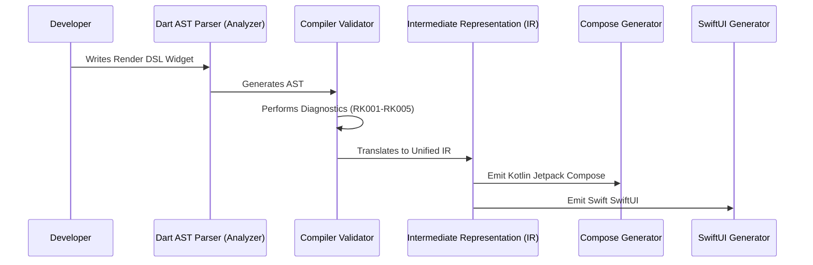

# RenderKit: Cross-Platform UI Compiler Spec

RenderKit is a declarative UI compilation framework that translates custom Dart DSL widgets into native Kotlin Jetpack Compose and Swift SwiftUI source code at compile-time. It completely bypasses runtime bridge layers, providing absolute native performance and direct integration with native toolchains.

## Core Pillars

1. **Zero Runtime Overhead**: No bridge (like React Native), no virtual machine runtime wrapper (like Flutter), and no WebViews. The compiler outputs idiomatic native code that compiles directly into native binaries.
2. **Deterministic UI Compiler**: Parses Dart source files, extracts a unified Abstract Syntax Tree (AST) and Intermediate Representation (IR), and runs optimization passes (dead widget removal, duplicate action warnings, state binding checks).
3. **Interactive Flutter Preview**: Generates high-fidelity previews within Flutter using state injection, giving developer hot-reload support without generating native outputs on every save.

## Package Architecture

```
e:/projects/flutter/plugins/renderkit/render_kit/
├── renderkit/                  # Core DSL declarations & Flutter preview component
├── renderkit_annotations/      # Lightweight compiler annotations (@RenderEntry)
├── renderkit_generator/        # AST parser, diagnostics, IR, Compose & SwiftUI generators
├── renderkit_cli/              # Dart CLI for project environment check and builds
├── docs/                       # High-fidelity architectural & API specs
└── examples/                   # Sample project demonstrating compiling DSL to Compose/SwiftUI
```

## Compilation Pipeline



---

## 📚 Documentation Index

* [Architecture & DSL Specification](dsl_spec.md)
* [Compiler Specification](compiler_spec.md)
* [CLI Specification & Commands](cli.md)
* [Widget API Reference](widget_api_reference.md)
